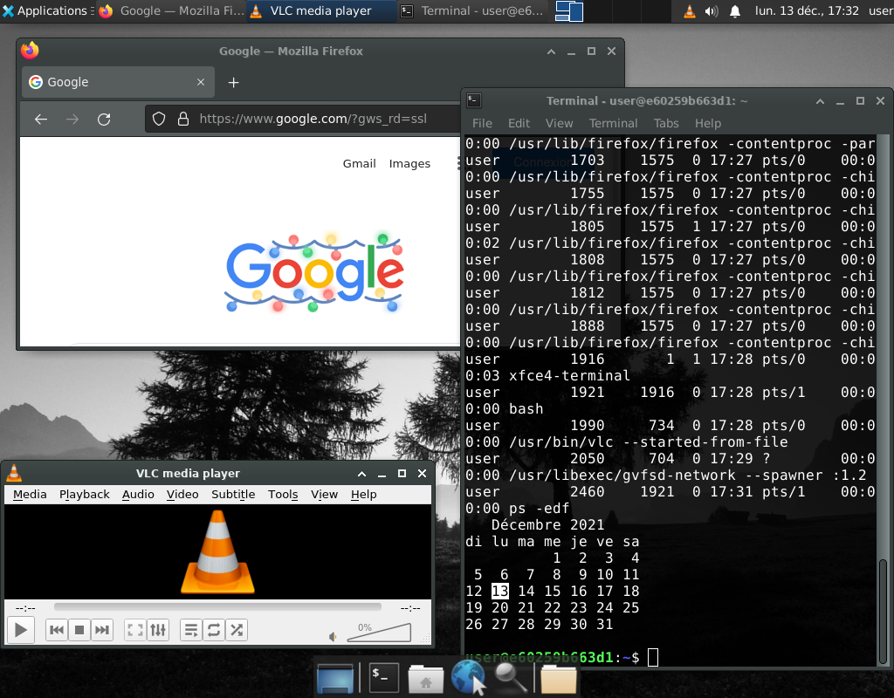

# docker-vnc-xfce4

## Description

How to run a GUI application inside a docker container, and to access the application within a browser.  
The easiest combo is to run 
- [Xvfb](https://www.x.org/releases/X11R7.6/doc/man/man1/Xvfb.1.xhtml) a virtual X server that can run on machines with no display hardware and no physical input devices. It emulates a dumb framebuffer using virtual memory
- a [VNC server](https://github.com/LibVNC/x11vnc) to be able to access from everywhere
- [noVNC](https://github.com/novnc/noVNC) + [websockify](https://github.com/novnc/websockify) that allow to do VNC through a browser
- [pulseaudio](https://www.freedesktop.org/wiki/Software/PulseAudio/) to share audio device
- a Window manager (see just below)

into an [Ubuntu](https://ubuntu.com/) base image.

It is possible to choose any windows manager, but some are lighter than others. Below, there will be two simple examples with light ones:
- [ratpoison](http://www.nongnu.org/ratpoison/)
- [Xfce](https://www.xfce.org/)

The final image size is 1.9Go.

## Build the docker image

When building the image it is possible to specify a personal timezone

    docker build .                \
      --file Dockerfile           \
      --tag docker-vnc-xfce4      \
      --build-arg TZ=Europe/Paris

It takes few minutes to make it.

## Usage

The built image expose standard ports:
- 5900 for VNC access (here are [VNC clients](https://www.realvnc.com/en/connect/download/viewer/))
- 6080 for noVNC website

So that for browser access the full address is [http://localhost:6080/vnc.html](http://localhost:6080/vnc.html).  
Applications starts with a simple user context: `user` (with password `user01`), and this user has `sudo` priviledges.  

### Start docker+vnc+xfce4

The most simple startup command is

    docker run --rm                    \
      --interactive                    \
      --tty                            \
      --publish 6080:6080              \
      --publish ${VNC_PORT:-5900}:5900 \
      --name desktop                   \
      --env LANG=fr_FR.UTF-8           \
      docker-vnc-xfce4

### Configuration

Some variables can be passed to the `docker run` command to modify image behavior.

| Name                         | Description                                              |
| ---------------------------- | ---------------------------------------------------------|
| DESKTOP_ADDITIONAL_PROGRAMS  | Automatically starts a program (ratpoison only)          |
| DESKTOP_BACKGROUND_IMAGE     | Default background image (can be an url)                 |
| DESKTOP_ENV                  | Choose desktop environment (between ratpoison and xfce4) |
| DESKTOP_KEYBOARD_LAYOUT      | Specify default keyboard layout (format: layout/variant) |
| DESKTOP_SIZE                 | Define the screen size (default 1280x1024)               |
| DESKTOP_THEME                | Set the default Xfce4 theme                              |
| DESKTOP_VNC_PASSWORD         | Set a VNC password (default is none)                     |

_Example_: run Xfce4 in french, with desktop personal settings and sound

    docker run --rm                                                                                               \
      --interactive                                                                                               \
      --tty                                                                                                       \
      --volume /run/user/$(id -u)/pulse/native:/run/user/1000/pulse/native                                        \
      --privileged                                                                                                \
      --publish 6080:6080                                                                                         \
      --publish ${VNC_PORT:-5900}:5900                                                                            \
      --name desktop                                                                                              \
      --env DESKTOP_ENV=xfce4                                                                                     \
      --env LANG=fr_FR.UTF-8                                                                                      \
      --env DESKTOP_KEYBOARD_LAYOUT="fr/azerty"                                                                   \
      --env DESKTOP_SIZE="1920x1080"                                                                              \
      --env DESKTOP_THEME="Greybird-dark"                                                                         \
      --env DESKTOP_BACKGROUND_IMAGE="https://upload.wikimedia.org/wikipedia/commons/9/96/Alberi_AlpediSiusi.JPG" \
      docker-vnc-xfce4 /bin/bash

In the `ratpoison` example a `firefox` browser is started in the image. To use another application it is necessary to

- first install it in [Dockerfile](Dockerfile) at line 103: `RUN	apt-get install ... notepadqq` (here we add `notepadqq`)
- then run it, by setting it in `DESKTOP_ADDITIONAL_PROGRAMS`

_Example_: run ratpoison with notepadqq in an interactive container

    docker run --rm                                        \
      --interactive                                        \
      --tty                                                \
      --privileged                                         \
      --publish 6080:6080                                  \
      --publish ${VNC_PORT:-5900}:5900                     \
      --name desktop                                       \
      --env LANG=fr_FR.UTF-8                               \
      --env DESKTOP_ENV=ratpoison                          \
      --env DESKTOP_SIZE="1024x800"                        \
      --env DESKTOP_ADDITIONAL_PROGRAMS=/usr/bin/notepadqq \
      docker-vnc-xfce4 /bin/bash

For more informations on `ratpoison` desktop manager see [general use page](http://www.nongnu.org/ratpoison/doc/General-Use.html#General-Use).

## Examples

